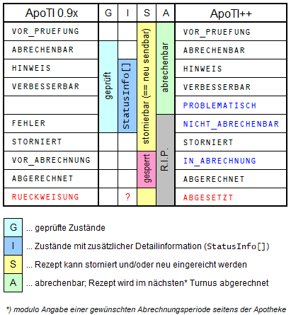

# Das ApoTI-Statusmodell

Ein über ApoTI eingereichtes Rezept kann im Lauf der Zeit verschiedene Zustände annehmen, die im API durch die Aufzählungstypen `vStatus`, `eStatus`, `m16Status` und `p16Status` (== Alias für `eStatus`) repräsentiert werden. Modulo eines kleineren historischen Unfalls¹ handelt es sich bei allen diesen Typen effektiv um Aliase oder Unterbereiche ein und desselben Basistyps mit einem rezeptartübergreifenden einheitlichen Statusmodell.

Die einzelnen Zustände entsprechen weitgehend dem 'Lebensweg' eines Rezeptes:

- `VOR_PRUEFUNG` → geprüft (ohne `FEHLER`) → `VOR_ABRECHNUNG` → `ABGERECHNET` → `RUECKWEISUNG`
- `VOR_PRUEFUNG` → `FEHLER`
- (`VOR_PRUEFUNG` | geprüft) → `STORNIERT`

Eine gewisse Sonderstellung bilden die abrechenbaren geprüften Zustände:
- `HINWEIS` = `ABRECHENBAR` + `Statusinfo[]`
- `VERBESSERBAR`³ = `HINWEIS` mit mehr Drama

Entscheidend für die Interoperabilität zwischen AVS und RZ ist Beachtung der Unterschiede zwischen den verschiedenen Statuswerten bezüglich Stornier- und Neueinreichbarkeit einerseits und Abrechenbarkeit andererseits.

In der Spalte ApoTI++ habe ich zum Teil andere Namen vergeben. Das ist nicht so sehr deswegen, weil eine nächste Iteration des Protokolls diese Namen verwenden könnte oder sollte, sondern viel mehr, um die tatsächliche Bedeutung der betreffenden Zustände klarer auszudrücken. 

Der Status `RUECKWEISUNG` ist bislang nicht klar definiert und kann auf zwei unterschiedliche praxisrelevante Konstellationen angewendet werden:
1) Das E-Rezept wurde von der Kasse als fehlerhaft abgewiesen (mitsamt dem gesamten Rest der Datenlieferung). Die Apotheke soll das E-Rezept umgehend reparieren und neu an das RZ übermitteln, damit das RZ eine Korrekturlieferung für die Kasse erstellen kann. Das Rezept wechselt also von `ABGERECHNET` über `RUECKWEISUNG` dann nach Neueinreichung direkt wieder auf `ABGERECHNET`.
2) Das Rezept wurde von der Kasse im Retaxationsverfahren abgesetzt. Die Apotheke kann das Rezept ggf. reparieren und neu einreichen. Falls nicht, dann *sollte* die Apotheke das Rezept analog zum Fall `FEHLER` stornieren (siehe [Transienz von `FEHLER` und `RUECKWEISUNG`][TvFuR]).

In der Praxis sollte eigentlich fast ausschließlich Fall 2 auftreten. Fall 1 ist relativ selten und wirft etliche praktische Probleme auf; er gehört besser ganz abgeschafft. Daher die Umbenennung von `RUECKWEISUNG` in `ABGESETZT`.

Weitere Details finden sich in den folgenden Artikeln:

- [(Nicht-)Abrechenbarkeit von `FEHLER`][NAvF]
- [Transienz von `FEHLER` und `RUECKWEISUNG`][TvFuR]
- [Statuswert für abgesetzte Rezepte][SfaR]

[TvFuR]: Transienz%20von%20FEHLER%20und%20RUECKWEISUNG.md
[NAvF]: (Nicht-)Abrechenbarkeit%20von%20FEHLER.md
[SfaR]: Statuswert%20für%20abgesetzte%20Rezepte.md

---
*1) Bei via `sendeRezepte` eingereichten E-Rezepten ist bis einschließlich ApoTI 0.9.2 für den logischen Zustand `ABRECHENBAR` die Schreibweise `'VOR_ABRECHNUNG'`² definiert, so daß der logische Zustand `VOR_ABRECHNUNG` dort entweder nicht verfügbar ist oder als `'IN_ABRECHNUNG'` übermittelt werden muß. Unabhängig von dieser Anforderung an die externe Kodierung der Statuswerte kann intern trotzdem mit dem einheitlichen Statusmodell gearbeitet werden; es muß den lediglich bei der Wandlung von API-Antworten zu und von XML ggf. eine Umsetzung erfolgen.* 

*2) Praktisch gesehen wird die klassische Schreibweise `'ABRECHENBAR'` von den AVS auch bei E-Rezepten weitgehend akzeptiert. In der nächsten Auflage von ApoTI sollte die einheitliche Schreibung von `ABRECHENBAR` als `'ABRECHENBAR'` über alle Rezeptarten hinweg wieder offiziell definiert werden, ungeachtet einer eventuellen Duldung von `'VOR_ABRECHNUNG'` bis zur Umstellung aller AVS.*

*3) Bei `VERBESSERBAR` war offensichtlich die ursprüngliche Intention, die mögliche Mehrausbeute für die Apotheke auch numerisch zu beziffern. Praktisch gesehen stellt sich diesbezüglich allerdings die Frage, wie zum Beispiel bei einem gefundenen Rabattvertragsverstoß das für eine Rezeptkorrektur avisierte Ausbleiben einer Vollabsetzung numerisch ausgedrückt werden soll ... Der nominelle Erstattungsbetrag des Rezepts kann hier nicht wirklich um einen Betrag X angehoben werden; vielmehr ist __die Vermeidung einer Kürzung um X__ das Ziel der angezeigten Verbesserung.*

---
*Stand 2023-02-14*
