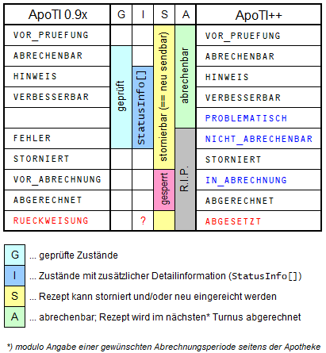

# Zulässigkeit von Statusübergängen

Die ApoTI-Spezifikation sieht ausdrücklich vor, daß bestimmte Rezeptzustände die Handlungsmöglichkeiten der einzelnen Akteure einschränken.

So können Rezepte in den Zuständen `VOR_ABRECHNUNG`¹ und `ABGERECHNET` von der Apotheke weder storniert noch neu eingereicht werden, und nur Rezepte mit abrechenbarem Zustand - also `VOR_PRUEFUNG`², `ABRECHENBAR`, `HINWEIS` und `VERBESSERBAR` - können vom Rechenzentrum abgerechnet werden.

Darüber hinaus kann nur die Apotheke Rezepte vom Zustand `STORNIERT` wegbringen (durch Neueinreichung). 

Eigentlich gehört auch `FEHLER` zu den Zuständen, bei denen die Apotheken normalerweise keine RZ-seitige Änderung des Rezeptzustands erwarten. Aufgrund der E-Rezept-Anlaufphase³ wird es sich aber nicht vermeiden lassen, Prüfergebnisse in Ausnahmefällen auch einmal zu revidieren. Damit könnte aus der Sicht der Apotheke ein Rezept im Einzelfall durchaus auch von `FEHLER` auf `ABGERECHNET` wechseln (z.B. mit den nicht beobachteten Zwischenzuständen `ABRECHENBAR` und `VOR_ABRECHNUNG`).

Letztendlich kann die Apotheke nur genau zwei Zustände herbeiführen (`VOR_PRUEFUNG` und `STORNIERT`), so daß mit die Spalte 'S' in der Statustabelle die Handlungsmöglichkeiten der Apotheke - a.k.a. 'mögliche Zustandsübergänge' - vollständig beschrieben sind.

Rechenzentrumsseitig sind mit Ausnahme von Übergängen von oder zu `STORNIERT` praktisch alle Statusübergänge möglich. Gemäß dem von der Spezifikation implizierten Prozeßmodell ist zwar im Regelfall nur eine Teilmenge davon zu erwarten, aber weitere Übergänge können aufgrund unvermeidlicher 'außerordentlicher' Korrekturen entstehen, und weitere wiederum aufgrund der Möglichkeit unbeobachteter Statusübergänge in den zeitlichen Lücken zwischen Statusabfragen seitens der Apotheke.

Das Erstellen vollständiger Übergangstabellen bzw. -matrizen ist daher vermutlich wenig hilfreich. Es ist sicher zielführender zu eruieren, ob Apotheken bzw. AVS bei Zuständen wie `FEHLER` bestimmte Immutabilitätsgarantien benötigen und diese ggf. unmißverständlich zu dokumentieren.

---
*1) `VOR_ABRECHNUNG` (a.k.a. 'IN_ABRECHNUNG') im Sinne des ApoTI-Statusmodells; der bei über `sendeRezepte` eingereichten E-Rezepten aufgrund einer historisch bedingten Anomalie als 'VOR_ABRECHNUNG' zu übermittelnde Status `ABRECHENBAR` ist hier nicht gemeint!*

*2) Rezepte im Zustand `VOR_PRUEFUNG` werden von den RZ zunächst geprüft und nur bei positivem Prüfergebnis (`ABRECHENBAR`, `HINWEIS`, `VERBESSERBAR`) der Abrechnung zugeführt. Abhängig von der zeitlichen Überlappung mit dem Abfrageintervall der Apotheke ist es aber leicht möglich, daß das AVS den Übergang in einen geprüften Zustand nicht gar nicht sieht. Aus der Sicht der Apotheke wechselt das Rezept dann scheinbar direkt von `VOR_PRUEFUNG` zu `ABGERECHNET` oder sogar zu `RUECKWEISUNG`.*

*3) und auch bei anderen tiefgreifenden/umfassenden Änderungen von TP3-Spezifikationen wie 2021 im Fall der Zusatzdaten*

---
Stand 2023-02-17